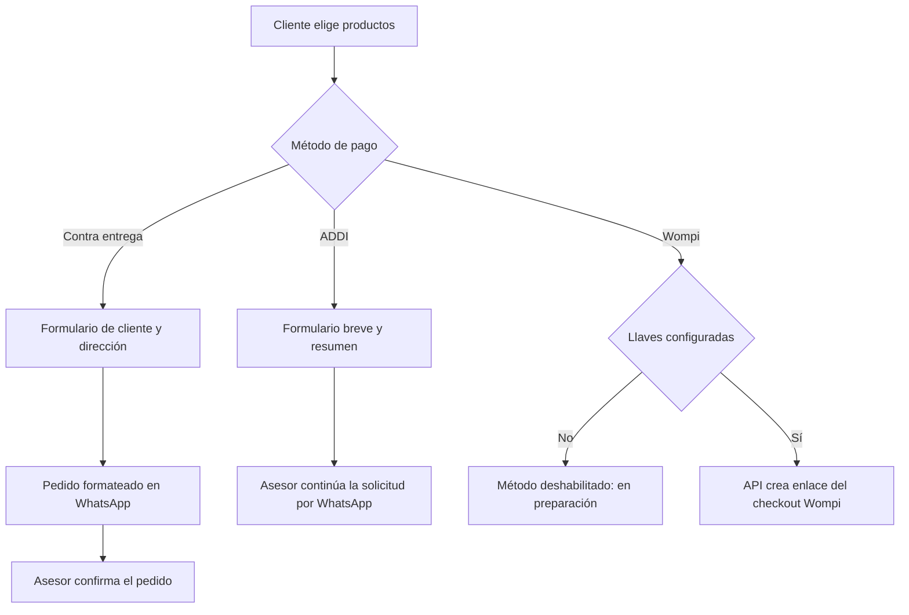

<div align="center">

# LARCS

### MÁS DE 30 AÑOS CREANDO CALZADO CON HISTORIA.

Empresa familiar, 100% colombiana. Calzado femenino hecho con experiencia, oficio y atención cercana.


</div>

## Sobre LARCS

LARCS es una empresa familiar colombiana con más de 30 años de experiencia en la fabricación de calzado femenino. Creemos en el talento local, en el valor del trabajo hecho con oficio y en el equilibrio entre diseño, belleza y comodidad.

La tienda organiza el catálogo por las hojas del archivo de producto: tacones, sandalias, botines, botas y flats (baletas).

## Funcionalidades

- Catálogo con filtros por categoría, color, talla y precio, además de ordenamiento y búsqueda.
- Fichas de producto con galería, detalles técnicos, colores y tallas disponibles en el Excel.
- Imágenes exportadas a WebP responsive, con carga diferida y prioridad de LCP en medios principales.
- Carrito con variantes por talla/color, control de unidades y persistencia local en el navegador.
- Pago contra entrega con formulario validado y pedido prellenado para WhatsApp.
- ADDI con resumen de producto o carrito y continuación manual con un asesor por WhatsApp.
- Formulario de contacto que prepara un mensaje para WhatsApp.
- Wompi preparado por variables de entorno; queda deshabilitado en la tienda mientras falten llaves.
- Diseño responsive, sección de identidad de marca y metadatos para SEO.

## Cómo se completa una compra



El envío a WhatsApp no completa automáticamente un pago ni vacía el carrito. El negocio confirma manualmente el pedido. Wompi requiere configurar el entorno antes de habilitar su checkout.

## Estructura

```text
Larcs/
├── public/
│   └── products/                 # Fotografías extraídas del Excel
├── reports/
│   └── products-import-report.json
├── scripts/
│   ├── import-products.py        # Importador reutilizable
│   └── requirements-import.txt   # openpyxl y Pillow
└── src/
    ├── app/                      # Rutas, páginas y endpoints
    ├── components/               # Catálogo, checkout, inicio y layout
    ├── data/products.json        # Catálogo generado; no editar a mano
    ├── Img/Logos/                # Logos y mapa, no son fotos de producto
    ├── lib/                      # Loader, configuración y utilidades
    ├── services/payments/        # Preparación de Wompi
    ├── store/                    # Carrito y favoritos
    └── types/                    # Tipos compartidos
```

El Excel fuente se encuentra en `src/components/Excel/archivo excel.xlsx`. El loader existente en `src/lib/products.ts` sigue siendo el punto de acceso para Inicio, catálogo, producto, sitemap y resumen de Wompi; ahora lee el manifiesto generado en vez de inferir datos desde nombres de archivos.

## Requisitos e instalación

- Node.js `>=20.11.1` y npm.
- Python 3 para actualizar el catálogo.

```bash
npm install
npm run dev
```

Abre `http://localhost:3000` para desarrollo local.

## Variables de entorno

Copia `.env.example` a `.env.local` y completa solo los valores necesarios. Nunca agregues archivos `.env*` al repositorio.

| Variable | Uso |
| --- | --- |
| `NEXT_PUBLIC_WHATSAPP_NUMBER` | Número de WhatsApp en formato internacional, solo dígitos. Tiene un valor predeterminado en la configuración pública. |
| `NEXT_PUBLIC_WOMPI_PUBLIC_KEY` | Llave pública del comercio Wompi. |
| `WOMPI_INTEGRITY_SECRET` | Secreto para firmar la solicitud de checkout. |
| `WOMPI_PRIVATE_KEY` | Llave privada para consultar transacciones desde el servidor. |
| `WOMPI_EVENTS_SECRET` | Secreto para validar eventos entrantes de Wompi. |
| `WOMPI_API_BASE_URL` | URL de la API de Wompi; por defecto usa sandbox. |
| `WOMPI_REDIRECT_URL` | URL pública opcional de retorno tras el checkout. |

Wompi permanece en preparación mientras falten `NEXT_PUBLIC_WOMPI_PUBLIC_KEY` o `WOMPI_INTEGRITY_SECRET`. No se deben escribir llaves en el código fuente, README, capturas ni mensajes de commit.

## Comandos

| Comando | Descripción |
| --- | --- |
| `npm run dev` | Inicia Next.js en desarrollo. |
| `npm run typecheck` | Ejecuta TypeScript sin emitir archivos. |
| `npm run lint` | Ejecuta ESLint según la configuración del proyecto. |
| `npm run build` | Genera la compilación de producción. |
| `npm run start` | Sirve la compilación de producción. |
| `npm run catalogo:actualizar` | Importa el Excel predeterminado y genera catálogo, fotos y reporte. |
| `npm run catalogo:actualizar -- --dry-run` | Valida el Excel y actualiza el reporte sin reemplazar el catálogo. |

## Actualizar el catálogo

1. Reemplaza `src/components/Excel/archivo excel.xlsx` por el Excel actualizado. Conserva las hojas `Tacones`, `Sandalias`, `Botines`, `Botas` y `Flats`, con referencias/nombre, ficha técnica y precio en las primeras cuatro columnas.
2. Instala las dependencias Python una vez:

   ```bash
   python -m pip install -r scripts/requirements-import.txt
   ```

3. Ejecuta la importación:

   ```bash
   npm run catalogo:actualizar
   ```

    Antes de reemplazar un catálogo existente, el script guarda el manifiesto y las fotos anteriores en `backups/catalog/<fecha>/`.

4. Revisa `reports/products-import-report.json`, `src/data/products.json` y ejecuta `npm run typecheck` y `npm run build`.

También puedes seleccionar otro archivo sin mover el predeterminado:

```bash
python scripts/import-products.py --source "C:\ruta\archivo.xlsx"
```

El script asocia cada imagen incrustada a la fila donde está anclada, mantiene su extensión y no genera productos duplicados por nombre: cada slug incluye hoja y fila. Las referencias Larcs faltantes o repetidas, tallas o colores ausentes, productos sin imágenes/precio, fichas incompletas e imágenes sin fila se incluyen en el reporte. Las filas sin nombre o precio y las hojas no reconocidas detienen la importación sin reemplazar el catálogo. El modo `--dry-run` permite revisar esos resultados antes de publicar. Los respaldos se excluyen de Git.

## Cambiar textos y contacto

- Número de WhatsApp: `NEXT_PUBLIC_WHATSAPP_NUMBER` en el entorno; su valor predeterminado se centraliza en `src/lib/constants.ts`.
- Textos de marca: `src/lib/brand-content.ts`.
- Mensaje de ADDI: `ADDI_WHATSAPP_MESSAGE_BASE` en `src/lib/constants.ts`.
- Mensaje de contra entrega: `buildCodWhatsAppMessage` en `src/lib/cod-whatsapp.ts`.

## Próximos pasos

- Configurar llaves por ambiente y terminar la integración de Wompi.
- Revisar en Lighthouse y dispositivos reales las rutas principales antes de cada despliegue.
- Automatizar pruebas de regresión para carrito, formularios y catálogo.

## Capturas

<!-- TODO: agregar capturas reales de Inicio, catálogo, ficha, carrito y checkout. -->

| Inicio | Catálogo |
| --- | --- |
| TODO: captura de Inicio | TODO: captura del catálogo |

| Producto | Checkout móvil |
| --- | --- |
| TODO: captura de ficha de producto | TODO: captura del checkout |

## Despliegue

Configura las variables de entorno en el proveedor de hosting, instala dependencias y ejecuta:

```bash
npm run build
npm run start
```

El Excel y las dependencias Python se necesitan al actualizar el catálogo, no para servir el storefront. Las llaves de Wompi son opcionales mientras el método permanezca en preparación.

## Créditos y contacto

Proyecto de la empresa familiar LARCS, 100% colombiana.

- Sitio: [larcs.co](https://www.larcs.co)
- Correo: [larscalzado@gmail.com](mailto:larscalzado@gmail.com)
- WhatsApp: configurar `NEXT_PUBLIC_WHATSAPP_NUMBER` en el entorno.
- Instagram: [@calzadolarcs](https://www.instagram.com/calzadolarcs/)

---

Hecho con oficio y más de 30 años de historia colombiana.
